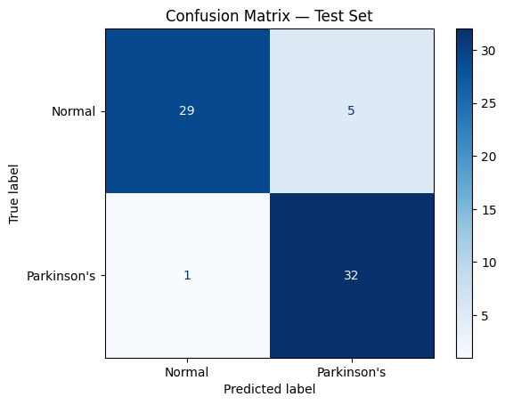
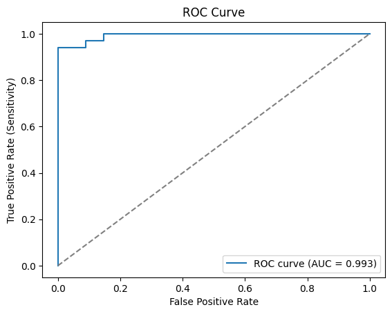
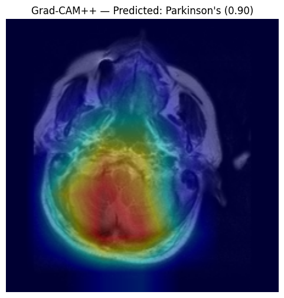

## 🚀 Live Demo

**Try the application here:**

https://parkinsons-detection-mri.streamlit.app/

---

# Parkinson's Disease Detection from Brain MRI (v2)

CNN-based classification of Parkinson's disease vs. healthy control using structural brain MRI,
built with transfer learning (EfficientNetB0) and Grad-CAM++ explainability.


## Improvements over v1
- Transfer learning (EfficientNetB0 pretrained on ImageNet) instead of a from-scratch CNN
- Proper class balancing + stratified train/val/test split
- Grad-CAM++ (sharper localization than vanilla Grad-CAM)
- Full metrics: accuracy, precision, recall, F1, ROC-AUC, confusion matrix
- Deployable via Streamlit instead of Tkinter

## Dataset
[Parkinson's Brain MRI Dataset — Kaggle](https://www.kaggle.com/datasets/irfansheriff/parkinsons-brain-mri-dataset)
- `normal/` — 610 images
- `parkinson/` — 221 images

Not included in this repo (too large + license considerations). Download separately — see setup below.

> Planning to swap in PPMI clinical data once access is approved — the pipeline is dataset-agnostic,
> so this just means pointing `DATA_DIR` at the new folder structure.

## Project Structure
```
parkinsons-mri-classifier/
├── README.md
├── requirements.txt
├── .gitignore
├── notebooks/
│   └── train_colab.ipynb      # Run this in Google Colab
├── src/
│   ├── dataset.py             # Data loading, splitting, augmentation
│   ├── model.py                # EfficientNetB0 transfer learning model
│   ├── train.py                 # Training loop
│   ├── evaluate.py             # Metrics + confusion matrix
│   ├── gradcam.py               # Grad-CAM++ visualization
│   └── app.py                    # Streamlit demo app
└── data/                         # gitignored — put downloaded dataset here
```

## Setup — Google Colab (training)
1. Open `notebooks/train_colab.ipynb` in Colab.
2. Runtime → Change runtime type → GPU (T4 is fine).
3. Get a Kaggle API token: kaggle.com → Account → Create New API Token (downloads `kaggle.json`).
4. Run the notebook cells top to bottom — it downloads the dataset via Kaggle API, trains, evaluates, and saves the model + Grad-CAM++ outputs.
5. Download the trained model (`model.h5`) and sample outputs from Colab before the session ends.

## Setup — Local / GitHub
```bash
git clone <your-repo-url>
cd parkinsons-mri-classifier
pip install -r requirements.txt
# place dataset in data/normal/ and data/parkinson/
python src/train.py
python src/evaluate.py
streamlit run src/app.py
```

# Results

The EfficientNetB0 transfer learning model achieved **91.0% test accuracy** with an **ROC-AUC of 0.993**.

More importantly, the model achieved **97% recall for the Parkinson's class**, indicating that it successfully identified nearly all Parkinson's cases while maintaining strong overall performance.

| Metric | Value |
|---------|-------|
| Accuracy | **91.0%** |
| Precision | **91.8%** |
| Recall (Sensitivity) | **91.0%** |
| F1-score | **91.0%** |
| ROC-AUC | **0.993** |

---

## Classification Report

| Class | Precision | Recall | F1-score |
|-------|----------:|--------:|----------:|
| Normal | 0.97 | 0.85 | 0.91 |
| Parkinson's | 0.86 | **0.97** | 0.91 |

---

## Confusion Matrix



---

## ROC Curve



---

## Grad-CAM++ Visualization

Grad-CAM++ provides visual explanations by highlighting the image regions that contributed most to the model's prediction, improving model interpretability.



---

## Technologies Used

- Python
- TensorFlow / Keras
- EfficientNetB0
- OpenCV
- NumPy
- Matplotlib
- Scikit-learn
- Streamlit
- Google Colab

---

## Future Work

- Compare the transfer learning model against a baseline CNN.
- Train and evaluate on larger MRI datasets such as **PPMI**.
- Fine-tune additional EfficientNet variants.
- Improve Grad-CAM++ visualizations.
- Deploy the Streamlit application on Streamlit Community Cloud.
- Extend the pipeline for multi-class neurological disease classification.

---

## License

This project is intended for educational and research purposes.

The MRI dataset is **not distributed** with this repository and remains subject to the original Kaggle dataset license and terms of use.
